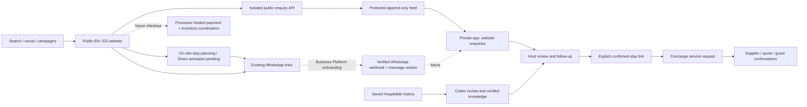

# White Swan: discovery → hospitality operations

Status: first connected release, September 15, 2026. White Swan is the public brand for the current Xanadu property. This is one property, not a completed multi-tenant SaaS.

## System boundaries

The public website remains GitHub Pages. Its form calls a separate Worker/D1 intake service. That service cannot read the private app database, Hospitable tokens, supplier contacts, door codes or guest conversation history. A read-only server credential allows the private app to pull its feed. The private app retains its existing owner-only identity gate. No browser has a feed credential.

## Running capabilities in this release

- Ten static English/Spanish pages with canonical/hreflang metadata, sitemap, responsive real property photos and a retained guest guide.
- Public enquiry form: service interest, dates, group size, contact information, free-text request and contact-only consent. A successful server receipt creates an enquiry, not a reservation or payment.
- A signed form session supplies a stable enquiry ID. Identical retries return the same receipt; changed payloads for that ID conflict. The form retains data on failure. Reopening after success starts a new enquiry.
- Optional first-party analytics with an allowlisted payload. No GA4/GTM tag is installed and no automatic marketing consent is inferred. Attribution is limited to consented campaign labels; it is self-reported browser data, not proof of causation.
- Private enquiry desk with on-demand feed sync, source/campaign context, internal notes, follow-up date and status. Idempotent imports and monotonically increasing checkpoints preserve existing operator edits.
- Explicit host handoff from a service enquiry to a confirmed reservation creates one `requested` concierge record. Guest/contact identities are not automatically merged. Supplier assignment, exact quote, guest acceptance, completion and payment reports remain separate facts.
- A bilingual reply starter can be copied for human review. It is deterministic text, not an autonomous AI response. No guest or supplier message is sent by these features.

## Measurement contract

| Event / record | Evidence | What it does not prove |
|---|---|---|
| `page_view` | Consented page loaded | Unique person or session |
| `enquiry_open` | Consented enquiry action | Submitted lead |
| `whatsapp_click` | Consented outbound click | Message sent or received |
| `airbnb_click` | Consented listing click | Booking or attributed revenue |
| Lead receipt | Accepted server submission | Verified identity or confirmed stay |
| Concierge handoff | Host-linked service request | Supplier availability or guest acceptance |

Traffic cards are all-time imported event counts. Lead counts include accepted enquiries; campaign tables exclude spam-marked leads. Consent and blockers make analytics incomplete. There is no claimed conversion rate, unique-user count or revenue attribution. Report attribution gaps explicitly.

One GA4 owner must approve the property, stream and installation method. Add one adapter from the existing PII-free event boundary; use `generate_lead` only after an accepted receipt if adding that event, and never use `purchase` for clicks or payment-page returns. Check duplicate tags and DebugView before activation. Do not add an unapproved tracking ID.

## WhatsApp next

The current `wa.me` links open the existing numbers and compose text; they cannot receive messages into our app. The enquiry continuation includes its reference so the operator can match context. The reference is an aid, not proof of identity or permission to disclose a stay.

Onboard the White Swan business with Meta Business Platform or an approved provider. Confirm ownership and supported coexistence/migration for the existing line before changing registration, devices or numbers. Establish account billing, operator ownership, app credentials, phone number ID and the verified business details. Nothing in this release registers or migrates the number.

Then implement a dedicated authenticated webhook receiver: verify the subscription challenge and raw-body signature; scope by the configured business/phone IDs; deduplicate provider message IDs; store the event before acknowledging; queue media processing with private access controls. Keep provider accepted/delivered/read/failed statuses separate. Send only through an outbox with stable attempt IDs, uncertain-send handling, channel-window checks and approved templates where required. Do not treat an inbound service enquiry as marketing opt-in or assume WhatsApp groups are supported.

Match a public enquiry reference as a suggestion for the operator. A verified guest/session or explicit human association is required before revealing reservation data. Preserve separate internal supplier discussion and guest messages. Routine verified answers are the first intended automatic capability; quotes, exceptions, charges and supplier commitments remain reviewed.

## Learning and the content loop

Use saved conversations and enquiry outcomes to identify missing answers, confusing policies and unsuccessful service handoffs. Extract source-linked proposals into the existing learning workspace. Owner verification precedes both agent retrieval and any public content publication. Guest claims, one-off concessions and incident reports do not become universal property policy. Never publish raw conversations or identity/access data as SEO content.

Record accepted/rejected suggestions, source versions and actual service outcomes. Evaluate answer correctness, escalation, supplier confirmation and language matching on a held-out set before introducing unattended agents. Codex supplies the present engineering/review pass; the deployed app is not using the Codex subscription as a background model API.

## Scaling sequence

1. **Release the website + intake:** upstream owner merges the website branch; check real enquiry receipt and operator sync; verify content and privacy ownership before campaign rollout.
2. **Operate one reliable channel:** Meta onboarding, verified webhooks, durable queues, retries/dead letters, alerts, retention/deletion and operator response SLAs. Add stronger bot protection and volume controls before materially increasing traffic.
3. **Connect direct payments:** approved local merchant, hosted checkout, signed payment webhooks, refunds, deposits, settlement reconciliation and a tested inventory-confirmation process. See [payment discovery](PAYMENTS.md).
4. **Run controlled intelligence:** app-owned model runtime, verified tenant-scoped retrieval, evaluations, escalation and human-reviewed actions. Add durable scheduler/event processing; a key alone does not activate this.
5. **Offer SaaS to other hosts:** independent sessions, organizations/memberships, per-tenant properties/domains/provider connections, vendor permissions, tenant quotas and isolation tests. Prefer each host's own merchant account unless the processor approves a platform/marketplace settlement model. The existing pilot scope constants are not tenant authorization.

## References checked

- [Google: multilingual sites](https://developers.google.com/search/docs/specialty/international/managing-multi-regional-sites) — separate language URLs and canonical/hreflang treatment.
- [Google: GA4 recommended events](https://developers.google.com/analytics/devguides/collection/ga4/reference/events) — lead measurement is distinct from purchases.
- [Meta-hosted SDK webhook reference](https://whatsapp.github.io/WhatsApp-Nodejs-SDK/api-reference/webhooks/start/) — subscription verification and request signature concepts. This older SDK reference is not a recommendation to use that SDK; re-check the current Cloud API payload/version during implementation.

## Current hosting gate

The current Sites workspace cannot publish a public intake API. The code is prepared in the separate private intake repository, but no public intake deployment is running. The public website currently uses a WhatsApp fallback, with form collection and analytics disabled; the admin integration remains unconfigured. An approved public host must be provisioned and verified before enabling collection.

## Shared concierge update — September 16, 2026

Website questions and all service interests now have direct, contextual WhatsApp entry links plus a bilingual concierge launcher. The future channel must reuse the portal’s agents and verified knowledge rather than introduce a separate website bot. The links carry topic, page and language in editable message text; they do not send, identify a reservation or create an app record. See [the shared concierge contract](SHARED_CONCIERGE.md) for reuse boundaries and activation requirements.
