# One concierge across the website, WhatsApp and the host portal

## Product decision

The White Swan website is an acquisition and conversation entry point. The **main portal remains the control plane** for agents, property knowledge, templates, guest context, service requests and human approvals. Do not create a separate website chatbot or copy the knowledge base into public JavaScript.

The same saved agent configurations and verified knowledge should serve multiple channels through a shared backend. Channels adapt message receipt/delivery; they do not each own a separate AI policy or a separate learned memory.

```mermaid
flowchart LR
  Website[Website: villa, services, local information] -->|Guest sends on WhatsApp| WA[WhatsApp Business channel]
  WA -. activation pending .-> Receiver[Signed webhook / durable inbox]
  Receiver --> Conversation[Property-scoped conversations and contact identity]
  Hospitable[Hospitable channel] --> Conversation
  Conversation --> Engine[Shared agent runtime and policy gate]
  Portal[Main portal: agent configuration, knowledge and templates] --> Engine
  Engine --> Draft[Suggested answer / human handoff]
  Engine -. routine auto after activation .-> Outbox[Channel delivery worker]
  Draft --> Host[Host review]
  Host --> Outbox
  Engine --> Request[Service interest / requested concierge task]
  Request --> Approval[Quote, supplier and guest confirmations]
  Conversation --> Learning[Source-linked learning proposals]
  Learning --> Review[Host verification]
  Review --> Portal
```

## Public entry points implemented

- An EN/ES “Ask White Swan” launcher on the homepage, photo tour and stay page.
- A homepage concierge section for villa/amenity questions, arrival, policies, the host, chef, massage, groceries, drinks, transfers, tours and celebrations.
- Service-card links open WhatsApp directly, with the selected interest already written.
- Each prefilled message identifies the White Swan page and preferred language. It does not include analytics query strings, hidden identifiers or private guest records.
- Native links and the launcher work without JavaScript. Guests can edit the text and must press Send themselves. No message is sent by the site, and a click does not create a CRM record.

These are **working WhatsApp entry links**, not a live AI integration. The existing owner number remains +503 7052-8003. The original guide’s separate on-site contact is preserved.

## Reuse the existing portal implementation

The private app already contains:

| Component | Reuse for WhatsApp |
|---|---|
| Saved `AgentProfile` / `guest_agents` | Same agent ID, revision, instructions, language, tone, selected knowledge and review mode. Add channel bindings; do not duplicate agents. |
| Verified knowledge / `knowledge_articles` | One authoritative store. Select current, permitted source revisions at answer time. |
| `replyAgentContext` | Existing saved-agent and verified-knowledge resolution. Refactor its fixed pilot scope into an authenticated channel scope before SaaS use. |
| `generateAgentReply` | Shared grounded reply generation and decisions. Currently generates human suggestions; it is not an automatic sender. |
| Conversation history and attributed runs | Persist channel-specific provider IDs alongside the shared conversation model; record exact agent/source revisions and human takeover. |
| Learning proposals and review | Include WhatsApp evidence in the same proposal/review process; never auto-promote guest claims into policy. |
| Concierge requests and supplier workflows | Interest becomes a requested task, then separately quoted, accepted, assigned and fulfilled. An AI cannot infer supplier availability from interest. |

Current portal `requestedMode: routine_auto` is a saved preference, not an active worker. The app-owned model connection, event receiver and durable delivery worker are not active. The current Codex engineering session is not an unattended customer-serving model endpoint.

## Permissions before intelligence

Map the receiving WhatsApp business/phone ID to an authorized property and organization on the server. Public page text, query parameters and topic labels are untrusted context; they cannot select a tenant, grant access or choose an internal agent.

A prospective guest can receive approved public property and service information. Possession of a WhatsApp phone number is not proof of a particular reservation. Linking a contact to a stay requires an explicit, verified association. Do not match solely on a name or a copied enquiry reference. Confirmed-stay information needs a stricter audience gate; supplier contacts and internal conversations stay private. Door/Wi-Fi/safe codes remain outside this public concierge and follow the existing Airbnb release rule.

Reuse a single knowledge store with an explicit audience filter for prospect, verified guest, supplier and host. The current guest-facing flag alone is not sufficient to grant reservation-specific access. An update to a knowledge article invalidates stale suggestions before sending.

## Channel activation work still required

1. Onboard the current White Swan number to WhatsApp Business Platform/Cloud API or an approved provider, confirming ownership and coexistence/migration before changing the existing app. Do not change the number as a shortcut.
2. Deploy a public, signature-verified webhook separate from the private portal’s audience gate. Store inbound messages durably and deduplicate by business/phone/provider message ID before acknowledging. Queue processing and privately store attachments.
3. Normalize inbound messages into shared conversations. Show channel, identity-verification state, service interests, history and human takeover in the portal. Prospect contacts do not require a reservation. Attribution remains a claim until supported by stronger evidence.
4. Bind the existing agents to the channel. Add an app-owned model runtime and evaluate public-question answers in English/Spanish. Routine supported questions can be the first automatic scope after tests and explicit activation. Missing knowledge, complaints and sensitive requests hand off. Offers, prices, exceptions and supplier commitments stay reviewed.
5. Deliver through a durable outbox with current channel-window/template checks, revision checks, source revalidation, human-takeover cancellation and exact run/message attribution. Unknown send outcomes are reconciled rather than blindly retried. Track accepted, delivered, read and failed separately.
6. Feed saved WhatsApp interactions and outcomes into the same learning workspace. Proposals require review and evaluation before changing published knowledge or agent behavior.

A saved journey template is not automatically a Meta-approved WhatsApp template. Maintain provider template ID, language and approval status as channel metadata without duplicating the main message intent. Do not assume consent for promotions from an inbound question.

## Acceptance examples

- A visitor selects **Private chef**, sends the prepared WhatsApp message, and appears in the portal as an unverified prospect with chef interest. The agent asks relevant questions; no supplier booking or price promise occurs.
- A visitor asks whether the villa has a private pool. The same saved support agent uses the same current verified article as the portal’s reply assistant. The resulting run records its sources and channel.
- A guest asks for a door code: the WhatsApp concierge does not disclose it based on claimed identity or a booking reference.
- The host takes over a conversation while an AI response is queued: the queue cancels the automatic reply before sending.
- A new guest reports an issue: it creates source-linked evidence for a learning proposal, not a new universal rule.

Provider reference: [Meta’s WhatsApp webhook documentation](https://developers.facebook.com/documentation/business-messaging/whatsapp/webhooks/overview). Verify the selected API version and provider contract during activation. No webhook, number registration, background model or automated send has been enabled by this website change.
